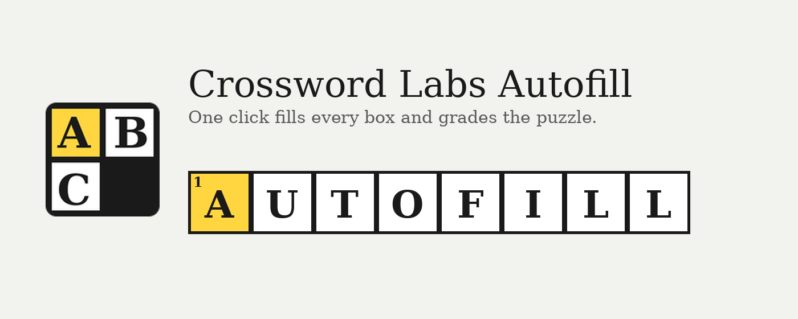
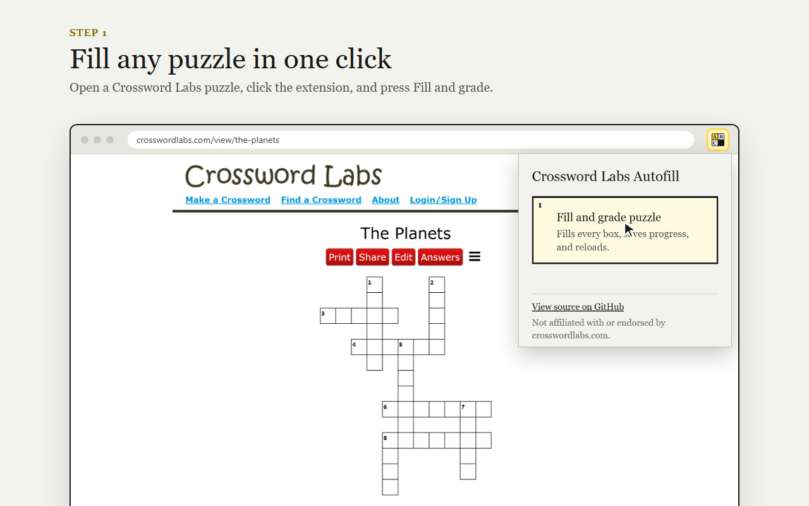
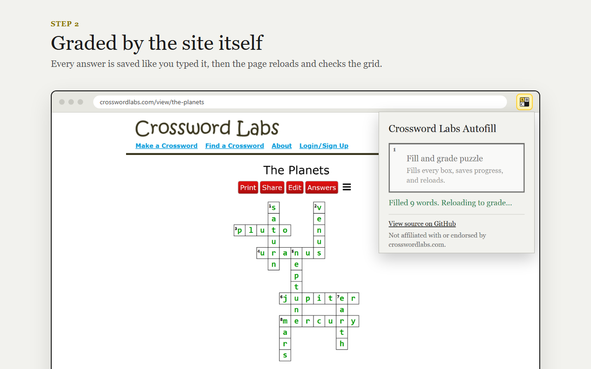

# Crossword Labs Autofill


A Chrome extension that fills in and grades any [Crossword Labs](https://crosswordlabs.com) puzzle with one click.



## Why it exists

When a puzzle page loads, Crossword Labs sends the complete solution to the browser in a global JavaScript variable (`grid`). Every cell's correct letter is in `grid[row][col].char`. The site's "Answers" button and its no-refund confirmation only gate the display of that data, not access to it. Grading also happens entirely in the browser. This extension demonstrates that exposure.





## Install

**From the Chrome Web Store:** [Crossword Labs Autofill](https://chromewebstore.google.com/detail/igcmjnaginhhlnkifafcnajkmeegocei)

**From source:**

1. Clone or download this repo.
2. Go to `chrome://extensions` and turn on **Developer mode**.
3. Click **Load unpacked** and select the `extension` folder.

## Usage

1. Open any puzzle on crosswordlabs.com.
2. Click the extension icon in the toolbar.
3. Click **Fill and grade puzzle**.

The grid fills in, your progress is saved the same way the site saves it, and the page reloads so the site grades it.

## How it works

The popup runs a script in the page's main JavaScript context (`chrome.scripting.executeScript` with `world: "MAIN"`), which is what lets it read the page's globals. A normal content script runs in an isolated world and can't see them.

The script:

1. Writes each `grid[r][c].char` into the matching SVG cell (`#cx-ROW-COL .cx-a`).
2. Finds where each word starts, from `index_to_row_column` and `index_to_direction`.
3. Rebuilds each word and stores it under the site's own `localStorage` progress key (`CROSSWORD_ID-wordIndex`).
4. Reloads the page. The site restores the saved answers and grades them itself.

Each step has a fallback, so a small change on the site shouldn't break it. If the word-start tables are missing, they're rebuilt from the `across`/`down` data on each grid cell. If `CROSSWORD_ID` is missing, it's read from the page's `og:image` URL. The page only reloads if progress was actually saved.

## Permissions

| Permission | Why |
| --- | --- |
| `activeTab` | Gives the extension access to the current tab only, and only after you click it. |
| `scripting` | Injects the fill script into that tab. |

The extension has no host permissions and no background script, makes no network requests, and collects no data. See the [privacy policy](PRIVACY.md).

## Project layout

```txt
extension/      The extension itself (load this folder unpacked)
  manifest.json
  popup.html    Popup UI
  popup.js      Popup logic and the injected fill script
  icons/
media/          Chrome Web Store images and README screenshots
test/           Automated tests (Node's built-in runner, no dependencies)
```

## Development

Run the tests with Node 18 or newer. There's nothing to install:

```bash
node --test
```

They run the fill script against a small made-up puzzle, with and without each fallback, and check every popup outcome, including the pre-filled issue link. GitHub Actions runs them on every push and pull request.

To release:

1. Bump `version` in `extension/manifest.json`.
2. Zip the *contents* of `extension/` so `manifest.json` sits at the root of the zip.
3. Upload the zip in the Chrome Web Store developer dashboard.

## Suggested fix for Crossword Labs

Don't send the solution grid to the client. Send only the grid shape (which cells exist and where words start), and check answers on the server.

## Reporting problems

If something goes wrong, the popup shows an error code and a **Report this problem on GitHub** link. The link opens a new issue with the code, the page URL, the extension version, and your browser version already filled in. Nothing is sent until you review it and submit the issue yourself.

| Code | Meaning |
| --- | --- |
| `E101` | No puzzle grid found on the page. |
| `E201` | Found the puzzle but couldn't fill any boxes. |
| `E202` | Filled the boxes but couldn't save progress, so the site won't grade it. |
| `E301` | Chrome wouldn't let the extension run in the tab. |
| `E302` | The script ran but returned nothing. |
| `E901` | Unexpected error. The report includes the stack trace. |

## Status

The extension is feature-complete and maintained on a best-effort basis. Issues are welcome and will be looked at when time allows. It has no dependencies and no build step, so it should keep working until Crossword Labs changes how it stores puzzles. Pull requests and forks are welcome under the MIT license.

## Disclaimer

This is a security research demonstration and an independent project. It is not affiliated with, authorized, maintained, or endorsed by CrosswordLabs.com. Many Crossword Labs puzzles are made by teachers for their classes; please don't use this to get around assignments.

## License

[MIT](LICENSE)
